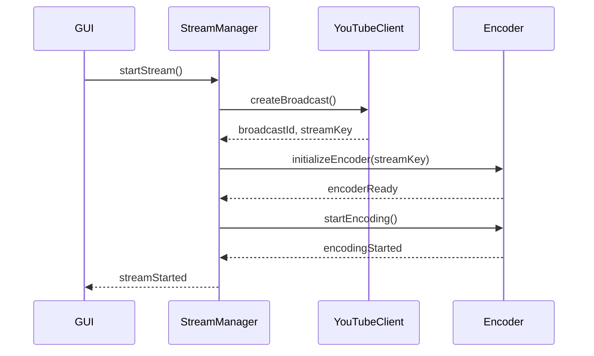
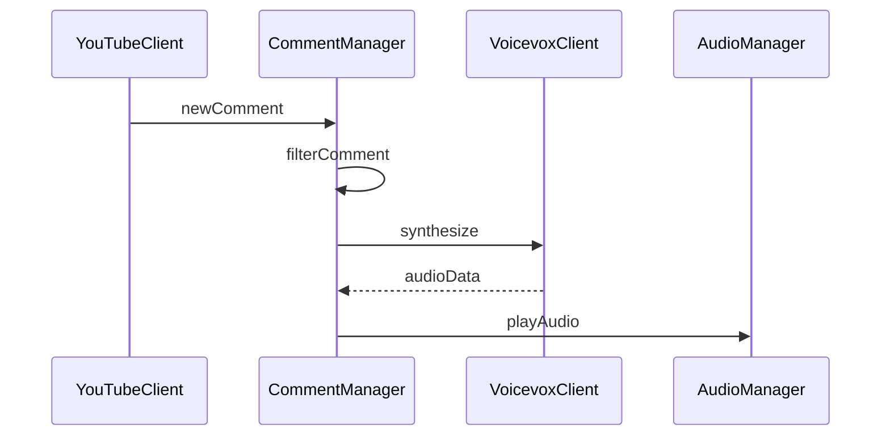

# YouTube Live 配信ツール詳細設計書

## 1. モジュール詳細設計

### 1.1 GUI 層（gui_module）

#### 1.1.1 メインウィンドウ（MainWindow）

```rust
pub struct MainWindow {
    window_state: WindowState,
    layout: Layout,
    tabs: Vec<Tab>,
}

pub enum Tab {
    Stream(StreamTab),
    Audio(AudioTab),
    Video(VideoTab),
    Banner(BannerTab),
    Comment(CommentTab),
}

pub struct Layout {
    main_split: Split,
    preview_area: Box<dyn Widget>,
    control_area: Box<dyn Widget>,
}
```

#### 1.1.2 各タブの構造

```rust
pub struct StreamTab {
    status_indicator: StatusIndicator,
    quality_controls: QualityControls,
    stream_controls: StreamControls,
}

pub struct AudioTab {
    bgm_player: BGMPlayer,
    effect_board: EffectBoard,
    mixer_controls: MixerControls,
}

pub struct VideoTab {
    camera_list: CameraList,
    screen_capture: ScreenCapture,
    layout_editor: LayoutEditor,
}
```

### 1.2 アプリケーション層（app_module）

#### 1.2.1 配信管理（StreamManager）

```rust
pub struct StreamManager {
    config: StreamConfig,
    encoder: Encoder,
    status_monitor: StatusMonitor,
}

impl StreamManager {
    pub async fn start_stream(&mut self) -> Result<(), StreamError> {
        // ストリーム開始処理
    }

    pub async fn stop_stream(&mut self) -> Result<(), StreamError> {
        // ストリーム停止処理
    }

    pub fn update_quality(&mut self, settings: QualitySettings) {
        // 品質設定更新
    }
}
```

#### 1.2.2 オーディオ管理（AudioManager）

```rust
pub struct AudioManager {
    mixer: AudioMixer,
    bgm_controller: BGMController,
    effect_controller: EffectController,
}

impl AudioManager {
    pub fn play_bgm(&mut self, track: &BGMTrack) {
        // BGM再生処理
    }

    pub fn play_effect(&mut self, effect: &SoundEffect) {
        // 効果音再生処理
    }

    pub fn adjust_volume(&mut self, source: AudioSource, volume: f32) {
        // 音量調整処理
    }
}
```

### 1.3 ドメイン層（domain_module）

#### 1.3.1 配信設定モデル

```rust
pub struct StreamConfig {
    stream_key: SecureString,
    quality_settings: QualitySettings,
    status: StreamStatus,
}

pub struct QualitySettings {
    video_bitrate: u32,
    audio_bitrate: u32,
    resolution: Resolution,
    fps: u32,
}

pub enum StreamStatus {
    Offline,
    Starting,
    Live,
    Ending,
    Error(StreamError),
}
```

#### 1.3.2 オーディオモデル

```rust
pub struct BGMTrack {
    id: TrackId,
    file_path: PathBuf,
    metadata: TrackMetadata,
    volume: f32,
}

pub struct SoundEffect {
    id: EffectId,
    file_path: PathBuf,
    hotkey: Option<HotKey>,
    volume: f32,
}

pub struct SuperchatSound {
    amount_threshold: u32,
    effect: SoundEffect,
}
```

### 1.4 インフラストラクチャ層（infra_module）

#### 1.4.1 YouTube API クライアント

```rust
pub struct YouTubeClient {
    auth_token: OAuth2Token,
    api_client: Client,
}

impl YouTubeClient {
    pub async fn create_broadcast(&self) -> Result<Broadcast, APIError> {
        // 配信作成API呼び出し
    }

    pub async fn update_stream(&self, status: StreamStatus) -> Result<(), APIError> {
        // 配信状態更新API呼び出し
    }

    pub async fn fetch_comments(&self) -> Result<Vec<Comment>, APIError> {
        // コメント取得API呼び出し
    }
}
```

#### 1.4.2 VOICEVOX 連携

```rust
pub struct VoicevoxClient {
    endpoint: String,
    voice_settings: VoiceSettings,
}

impl VoicevoxClient {
    pub async fn synthesize(&self, text: &str) -> Result<AudioData, VoiceError> {
        // 音声合成API呼び出し
    }

    pub fn update_settings(&mut self, settings: VoiceSettings) {
        // 音声設定更新
    }
}
```

## 2. データベース設計

### 2.1 テーブル構造

```sql
-- 配信設定テーブル
CREATE TABLE stream_settings (
    id INTEGER PRIMARY KEY,
    stream_key TEXT NOT NULL,
    video_bitrate INTEGER NOT NULL,
    audio_bitrate INTEGER NOT NULL,
    resolution_width INTEGER NOT NULL,
    resolution_height INTEGER NOT NULL,
    fps INTEGER NOT NULL
);

-- BGMトラックテーブル
CREATE TABLE bgm_tracks (
    id INTEGER PRIMARY KEY,
    file_path TEXT NOT NULL,
    title TEXT NOT NULL,
    artist TEXT,
    volume REAL NOT NULL
);

-- 効果音テーブル
CREATE TABLE sound_effects (
    id INTEGER PRIMARY KEY,
    file_path TEXT NOT NULL,
    name TEXT NOT NULL,
    hotkey TEXT,
    volume REAL NOT NULL
);
```

## 3. 処理フロー詳細

### 3.1 配信開始シーケンス



### 3.2 コメント処理シーケンス



## 4. エラーハンドリング詳細

### 4.1 エラー定義

```rust
#[derive(Debug, Error)]
pub enum AppError {
    #[error("Stream error: {0}")]
    StreamError(#[from] StreamError),

    #[error("API error: {0}")]
    APIError(#[from] APIError),

    #[error("Audio error: {0}")]
    AudioError(#[from] AudioError),

    #[error("Voice synthesis error: {0}")]
    VoiceError(#[from] VoiceError),
}

#[derive(Debug, Error)]
pub enum StreamError {
    #[error("Failed to connect: {0}")]
    ConnectionError(String),

    #[error("Invalid stream key")]
    InvalidStreamKey,

    #[error("Encoder error: {0}")]
    EncoderError(String),
}
```

## 5. 設定ファイル形式

### 5.1 アプリケーション設定（config.toml）

```toml
[stream]
default_quality = "high"
auto_reconnect = true
reconnect_attempts = 3

[audio]
master_volume = 1.0
bgm_volume = 0.5
effects_volume = 0.7

[voice]
engine = "voicevox"
character = "ずんだもん"
speed = 1.0

[security]
encrypt_stream_key = true
secure_storage = "keychain"
```

## 6. パフォーマンス最適化

### 6.1 スレッド管理

```rust
pub struct ThreadPool {
    video_thread: JoinHandle<()>,
    audio_thread: JoinHandle<()>,
    network_thread: JoinHandle<()>,
    worker_threads: Vec<JoinHandle<()>>,
}

impl ThreadPool {
    pub fn new() -> Self {
        // スレッドプール初期化
    }

    pub fn spawn_video_task(&self, task: impl FnOnce()) {
        // 映像処理タスク実行
    }

    pub fn spawn_audio_task(&self, task: impl FnOnce()) {
        // 音声処理タスク実行
    }
}
```

## 7. セキュリティ実装

### 7.1 認証情報管理

```rust
pub struct SecureStorage {
    keychain: Keychain,
}

impl SecureStorage {
    pub fn store_token(&self, token: OAuth2Token) -> Result<(), SecurityError> {
        // トークン暗号化保存
    }

    pub fn retrieve_token(&self) -> Result<OAuth2Token, SecurityError> {
        // トークン復号化取得
    }
}
```
