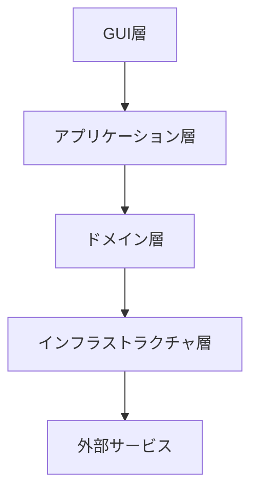
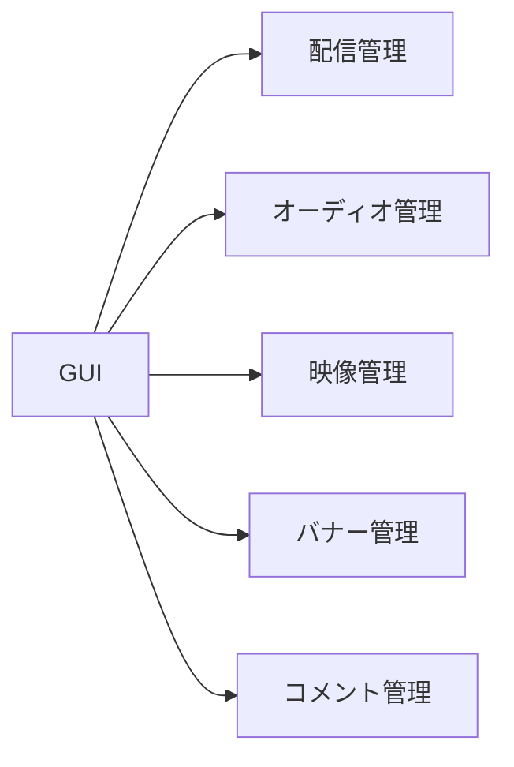
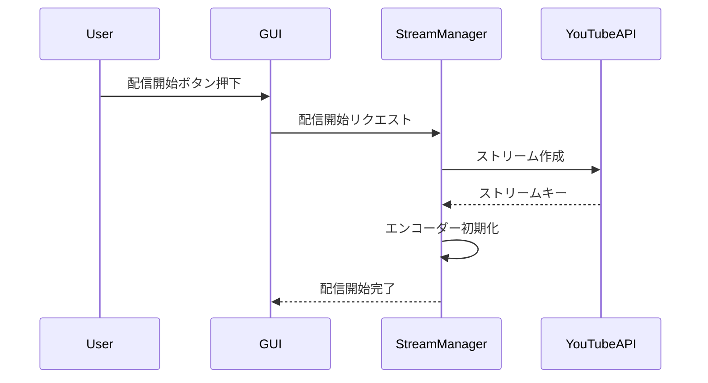

# YouTube Live 配信ツール基本設計書

## 1. システムアーキテクチャ

### 1.1 全体構成



- **GUI 層**: Druid を使用したユーザーインターフェース
- **アプリケーション層**: ユースケースの実装
- **ドメイン層**: ビジネスロジック
- **インフラストラクチャ層**: 外部サービスとの連携
- **外部サービス**: YouTube API、VOICEVOX 等

### 1.2 モジュール構成



## 2. 詳細設計

### 2.1 データモデル

```rust
// 配信設定
struct StreamConfig {
stream_key: String,
quality_settings: QualitySettings,
status: StreamStatus,
}
// オーディオ設定
struct AudioManager {
bgm_playlist: Vec<BGMTrack>,
sound_effects: HashMap<HotKey, SoundEffect>,
superchat_sounds: Vec<SuperchatSound>,
}
// 映像設定
struct VideoManager {
cameras: Vec<CameraInput>,
screen_share: ScreenShareConfig,
}
// バナー設定
struct BannerManager {
banners: Vec<Banner>,
rotation_settings: RotationSettings,
}
// コメント設定
struct CommentManager {
voice_settings: VoiceSettings,
ng_words: Vec<String>,
}
```

### 2.2 主要コンポーネント

#### 2.2.1 配信管理コンポーネント

- YouTube API クライアント
- 配信状態監視
- エンコーダー設定

#### 2.2.2 オーディオ管理コンポーネント

- BGM プレーヤー
- 効果音プレーヤー
- オーディオミキサー

#### 2.2.3 映像管理コンポーネント

- カメラキャプチャー
- スクリーンキャプチャー
- 映像合成

#### 2.2.4 バナー管理コンポーネント

- バナーレンダラー
- ローテーションスケジューラー

#### 2.2.5 コメント管理コンポーネント

- コメントフェッチャー
- VOICEVOX 連携
- テキスト解析

### 2.3 処理フロー

#### 2.3.1 配信開始フロー



## 3. 技術スタック

### 3.1 フロントエンド

- **UI フレームワーク**: Druid
- **グラフィックス**: Skia
- **アニメーション**: druid-animation

### 3.2 バックエンド

- **言語**: Rust
- **非同期処理**: tokio
- **シリアライズ**: serde

### 3.3 外部連携

- **YouTube API**: google-apis-rs
- **音声合成**: voicevox-rs
- **データベース**: SQLite

## 4. セキュリティ設計

### 4.1 認証情報管理

- OAuth2 トークンの暗号化保存
- キーチェーン連携

### 4.2 データ保護

- 設定ファイルの暗号化
- セキュアな一時ファイル管理

## 5. パフォーマンス設計

### 5.1 最適化戦略

- マルチスレッド処理の活用
- メモリプール実装
- 効率的なバッファリング

### 5.2 リソース管理

- 自動メモリ解放
- リソースの遅延読み込み
- キャッシュ戦略

## 6. エラーハンドリング

### 6.1 エラー種別

- ネットワークエラー
- API 制限エラー
- リソースエラー
- 権限エラー

### 6.2 リカバリー戦略

- 自動再接続
- フォールバック処理
- グレースフルデグラデーション

## 7. テスト戦略

### 7.1 テスト種別

- ユニットテスト
- 統合テスト
- パフォーマンステスト
- UI 自動テスト

### 7.2 テスト環境

- モックサーバー
- テストデータセット
- CI/CD 連携
