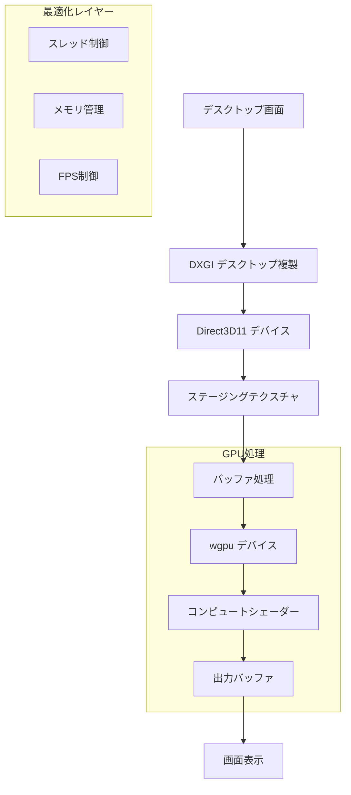
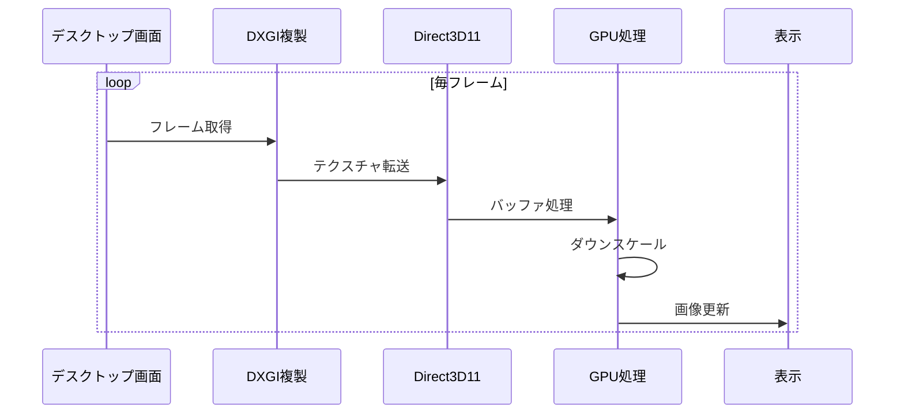

# 画面キャプチャ機能の開発記録

## 1. 基本実装

1. Direct3D11 を使用した画面キャプチャの基本実装
2. DXGI を使用したデスクトップデュプリケーションの実装
3. フレームバッファの取得と変換処理の実装

## 2. パフォーマンス最適化 (第 1 段階)

1. スレッドの優先度を上げて処理速度を改善
2. フレーム取得間隔の最適化（33ms から調整開始）
3. バッファの再利用によるメモリ効率の改善

## 3. 解像度と FPS の調整

1. 解像度を 1/2 に下げて処理負荷を軽減
2. フレーム更新頻度の調整（数フレームに 1 回の更新）
3. ピクセルサンプリング間隔の最適化

## 4. GPU 処理の導入

1. wgpu を使用した GPU 処理の基盤実装
2. コンピュートシェーダーの実装（バイリニア補間）
3. GPU リソース管理構造体の実装

## 5. 最終的な最適化

1. 解像度を 1/4 に調整
2. バッファ処理の効率化
3. フレーム更新頻度の最適化（8 フレームに 1 回）
4. スピンループの調整

## 達成したパフォーマンス

- 安定した 60FPS 前後の動作を実現
- メモリ使用量の効率化
- CPU 負荷の軽減

## 今後の課題

1. GPU 処理の更なる最適化
2. 画質と性能のバランス調整
3. マルチモニター対応
4. リソース管理の改善

# 画面キャプチャ機能の開発記録

## システム構成図

## 処理フロー

